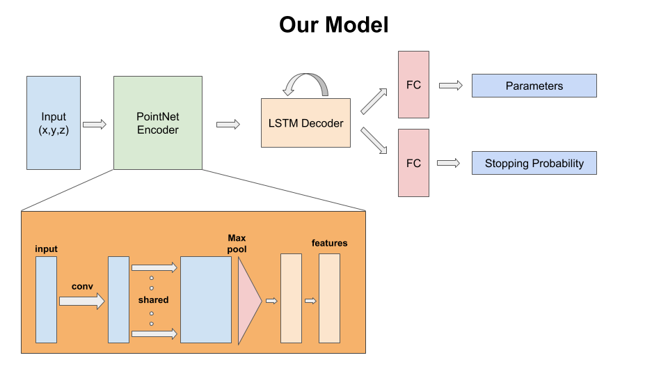
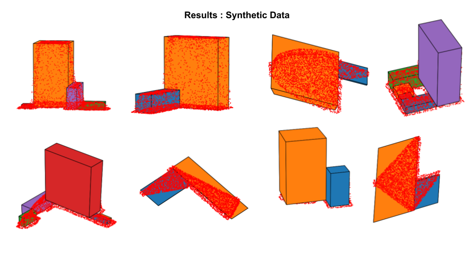

# 3D Primitive Fitting to Point Clouds
The goal for the 3D primitive fitting task is to represent buildings and other man-made structures as a collection of parameterized 3D volumetric primitives. The input for this task is a 3D point cloud with only (x,y,z) point tuples and no color information. The expected output is a collection of primitives (for now, cuboids) parameterized by their shape, location and orientation which is represented as a 7 dimensional vector: (width, height, depth, location_x, location_y, location_z, angle_theta).

### Overall Pipeline

### Model Architecture

### Results on synthetic data

## Getting Started

The `requirements.txt` file lists the `Python` dependencies for this project. All code was tested using `Python 3.6.6` on an `Ubuntu 16.04` desktop machine. The code organization is as follows:
* `data` : location for reading/writing data from; input is always a `ply` file containing a point cloud. The point cloud is always sampled to be `4096` points with only `(x,y,z)` coordinates.
* `code` : location for code scripts
* `inference` : location for scripts to test the trained model.
* `saved_models` : location for storing pretrained models.
* `images` : images depicting overall pipeline and model architecture

In the `data` directory, we have:
* `raw` : location for reading the `dhm.tif` and `ndx.tif` files.
* `real` : location for storing the processed `raw` data for real buildings. These files would be used by the model for testing.
* `synthetic` : location for storing samples of synthetic data.

Within the `code` directory, we have:
* `core` : location for storing common scripts used across the project.
* `inference` : applying the trained model on new data.
* `preprocessing` : preparing data for feeding to the model.

Note: Only the code has been uploaded here and the structure above describes how to adapt the code for a dataset.

## Preprocessing

**Training**
Synthetic data for training is generated along with the ground truth parameter values using some internal code that is not released here.

**Testing**
The model consumes a point cloud of size `4096x3` as input which is read from a `ply` file.

Each of these point clouds is still in the world coordinate frame. We bring the point clouds to a canonical unit cube during training and pass that point cloud to the model. This is done by centering the point cloud to origin and scaling it to make it's longest edge lie along an axis. These normalization steps are part of the `test.py` script and do not change files on disk.

## Running the model

The main execution script is `code/inference/test.py`. This script takes several arguments as can be seen there. Some of the important choices here are: which trained model to use, how many primitives to predict amongst(max count), data and output path. We provide 5 trained models in the `saved_models` directory. These models are named as `norot_rnn*.pth` where `*` can be one of `[1,2,3,4,5]`. Here, the number indicates the maximum count of primitives the model was trained to predict. The models with lower counts give more reasonable outputs for a large number of cases at the cost of loss of detail. Models with more number of primitives capture detail in many cases, but are prone to wrong predictions because of the mistakes made by the counting branch of the model. If the predicted count is incorrect, the primitives are likely to be not a good fit. It is also possible to always predict a fixed number of primitives for each of these models by setting the appropriate flag `var_count=False`. The `norot` in names of these models indicates that they have been trained without having rotation as an output parameter. For all these models, the `num_params` is thus 6. From our experiments we found this to work fine since most instances of the buildings are aligned along some axis after the normalization step. Additionally, predicting rotation alongside leads to some odd cases of saddle points due to symmetries thereby missing out on some of the easier cases.

This script saves a number of outputs to disk:
* `npy` numpy array of parameters for the predicted primitives (in the canonical unit cube space)
* `jpg` image of the point cloud and the primitive configuration
* `obj` file storing the 3D primitives overlayed on the point cloud
* `obj` file storing the 3D primitives
* (optional) `gif` file of the animated plot of the point cloud and primitives

While we do not perform any further optimization for fine-tuning the results of the trained model, we apply a simple verification step to remove predicted primitives that lie completely within another primitive. This can be further modified to allow only primitives which have a percentage overlap lower than a threshold, but we don't include code for that here (for now).

## Visualization

The visualization script is called from within `test.py` and stores output files as mentioned above. These `obj` files can be viewed in any viewer application such as `MeshLab`. Optionally, one can convert these to `ply`. Note that the files stored to disk are named based on number of files in the corresponding folder. Also, the primitives in `obj` files are assigned face colors and hence one might need to change `MeshLab` setting if the colors don't show correctly. On Ubuntu, the option is `Render --> Color --> Per Face`.
